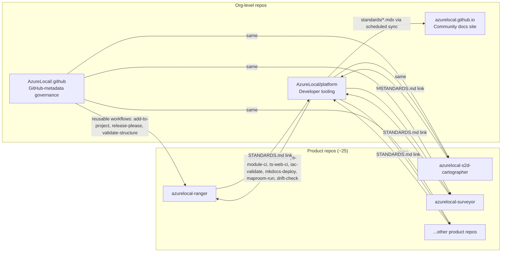
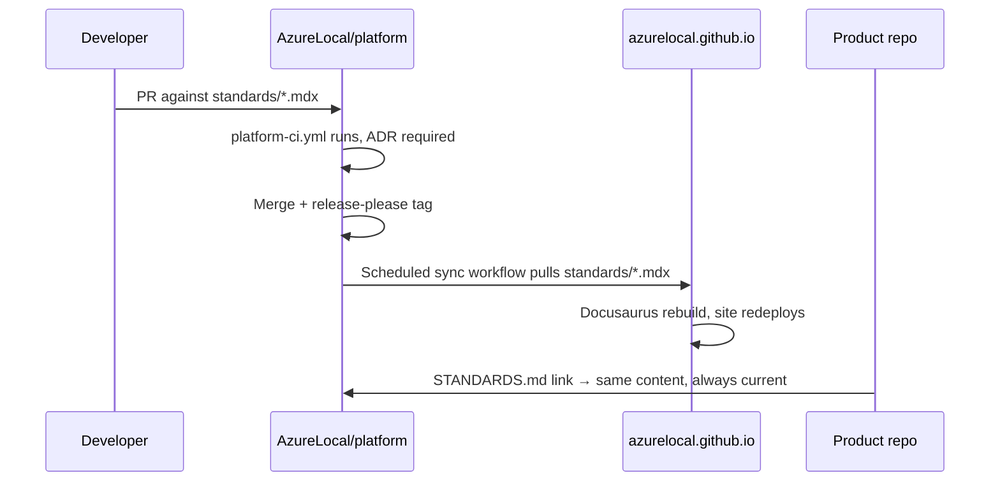
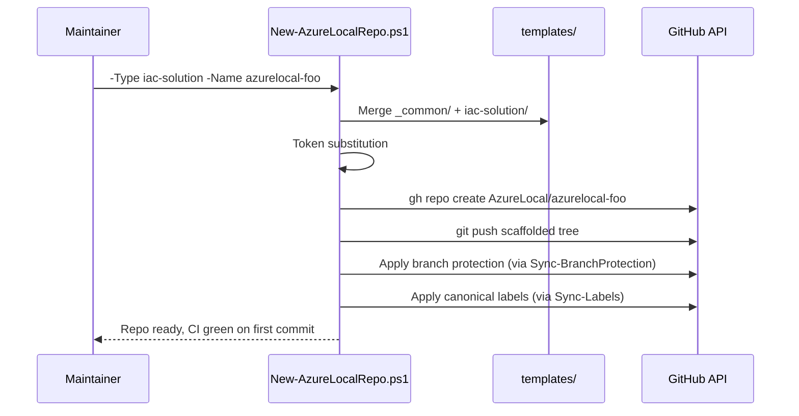

# Architecture overview

How `AzureLocal/platform` fits into the broader AzureLocal organization.

## The three central repos

## Who owns what

| Responsibility | Repo | Examples |
|---|---|---|
| GitHub-metadata governance | `AzureLocal/.github` | `CONTRIBUTING.md`, `SECURITY.md`, PR template, issue templates, org profile README |
| Governance reusable workflows | `AzureLocal/.github` | `reusable-add-to-project`, `reusable-release-please`, `reusable-validate-structure` |
| Canonical standards | `AzureLocal/platform` | `standards/naming.mdx`, `standards/testing.mdx`, all `.mdx` files |
| Stack-specific reusable workflows | `AzureLocal/platform` | `reusable-ps-module-ci`, `reusable-ts-web-ci`, `reusable-iac-validate`, `reusable-mkdocs-deploy` |
| MAPROOM framework | `AzureLocal/platform` | `testing/maproom/framework/`, generators, harness, schema |
| TRAILHEAD templates | `AzureLocal/platform` | `testing/trailhead/templates/` |
| IIC canon | `AzureLocal/platform` | `testing/iic-canon/*.json` |
| Repo bootstrap scripts | `AzureLocal/platform` | `repo-management/org-scripts/New-AzureLocalRepo.ps1` |
| Drift audit | `AzureLocal/platform` | `drift-audit.yml` workflow + `Invoke-RepoAudit.ps1` |
| Community-facing docs rendering | `azurelocal.github.io` | Docusaurus site that renders standards pulled from platform |
| Product source code | Product repos | `Modules/`, `src/`, `bicep/`, etc. |
| Product-specific fixtures | Product repos | `tests/maproom/Fixtures/*.json` per product |

## Data flow — standards update

## Data flow — new repo creation

## Versioning and release cadence

- **Platform**: `release-please`-driven, SemVer, monorepo mode. Major tag (`v1`, `v2`) is what consumers pin.
- **Reusable workflows**: consumers pin `@v1` (major). Minor/patch updates propagate automatically. Breaking change → new `v2` tag + six-month dual-support.
- **Standards**: versioned as part of the platform release stream. Sync workflow in `azurelocal.github.io` pulls on release tag.
- **IIC canon**: frozen post-v1. Changes require ADR.

See [`governance/versioning.md`](../governance/versioning.md) and [`governance/breaking-changes.md`](../governance/breaking-changes.md).

## Further reading

- [What is platform](what-is-platform.md)
- [Why platform exists](why-platform-exists.md)
- [Glossary](glossary.md)
- [ADR 0001 — Create platform repo](https://github.com/AzureLocal/platform/blob/main/decisions/0001-create-platform-repo.md)
