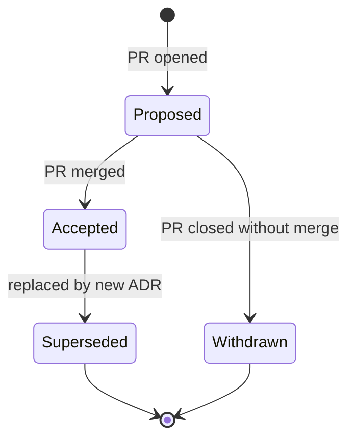

# ADR process

Architecture Decision Records (ADRs) are lightweight, numbered, immutable records of cross-cutting decisions for the AzureLocal platform and its consumer repos.

## When an ADR is required

Open an ADR when your change:

- **Touches standards** — any substantive edit to `standards/*.mdx` (not typo fixes)
- **Adds, changes, or removes a reusable workflow** — new workflow, new input, or breaking change
- **Modifies IIC canon** — any change to `testing/iic-canon/*.json` (treated as frozen post-v1)
- **Adds or removes a template variant**
- **Affects the contract between platform and consumers** — metadata schema, breadcrumb rules, version pinning strategy
- **Deprecates anything** that consumer repos currently rely on

You do NOT need an ADR for:

- Typo fixes in standards
- Bug fixes in reusable workflows that don't change inputs or behavior
- Adding a new page to `docs/` that describes existing behavior
- Internal refactors of `modules/powershell/AzureLocal.Common/` that don't change public surface

## Format

Every ADR follows [`template.md`](https://github.com/AzureLocal/platform/blob/main/decisions/template.md). Four required sections:

1. **Context** — what problem, what constraints, what prompted this
2. **Decision** — what we chose, one paragraph max, explain *why*
3. **Consequences** — positive, negative, neutral, affected repos/owners
4. **Status** — Proposed, Accepted, or Superseded by ADR XXXX

Plus:

- **Alternatives considered** — options we rejected with one-line reasons

## Filename convention

`NNNN-kebab-case-title.md` where NNNN is a zero-padded sequential integer. Example: `0005-iic-canon-version-schema.md`.

Numbers are never reused. If an ADR is withdrawn before acceptance, still increment — subsequent ADRs don't renumber.

## Lifecycle

- **Proposed** — PR is open, review in progress
- **Accepted** — PR merged, decision is binding
- **Superseded** — an accepted ADR is replaced by a later ADR. The original ADR stays in the repo, with its Status updated to link to the replacement. Never delete ADRs.
- **Withdrawn** — PR closed without merge; numbered but not part of history

Accepted ADRs are immutable except for corrections to the Status field when superseded. Don't silently edit an accepted ADR — write a new ADR that supersedes it.

## Workflow

1. **Open a draft PR** with the new ADR at `decisions/NNNN-title.md`, Status `Proposed`
2. **Reference the ADR from the code change** (if any) in the same PR, or in a follow-up PR that links to the ADR
3. **Review** — CODEOWNER review, plus self-review documentation if solo-maintained
4. **Merge** — update Status to `Accepted`, update `decisions/README.md` index table
5. **Implement** — follow-up PRs reference the ADR number in commit messages

For purely-informational ADRs (no code follow-up), step 5 is skipped.

## Index

The authoritative index lives in [`decisions/README.md`](https://github.com/AzureLocal/platform/blob/main/decisions/README.md). Keep it sorted by number.

## Example ADRs

- [0001 — Create AzureLocal platform repo](https://github.com/AzureLocal/platform/blob/main/decisions/0001-create-platform-repo.md)
- [0002 — Standards single source](https://github.com/AzureLocal/platform/blob/main/decisions/0002-standards-single-source.md)

## Common questions

**"Can an ADR span multiple repos?"** Yes — that's exactly what they're for. The ADR lives in `platform` regardless of which product repo it affects.

**"What if the decision is reversed?"** Write a new ADR that supersedes the old one. The old ADR's Status becomes `Superseded by NNNN`. Both remain.

**"How long should an ADR be?"** 200-600 words for most decisions. 1000+ only for genuinely complex cross-cutting calls with many alternatives.

**"Do ADRs go in a CHANGELOG?"** Yes — each accepted ADR gets an entry in `CHANGELOG.md` under the release that included it.
