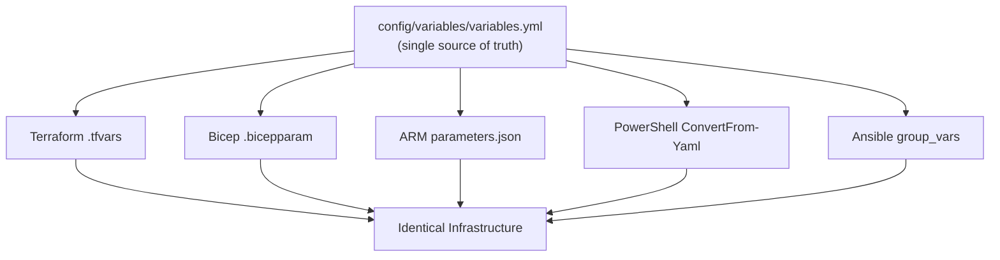

# Automation Interoperability

> **Canonical reference:** [Scripting Framework (full)](https://azurelocal.cloud/standards/scripting/scripting-framework)  
> **Applies to:** All AzureLocal repositories  
> **Last Updated:** 2026-03-17

---

## Overview

This standard defines how multiple automation tools (Terraform, Bicep, ARM, PowerShell, Ansible) interoperate across AzureLocal solutions. All tools share a single configuration source and must produce identical infrastructure.

---

## Config Flow

---

## Deployment Path Matrix

| Tool | Azure Resources | Configuration | Monitoring | Scaling |
|------|:---:|:---:|:---:|:---:|
| **Terraform** | ✅ | Delegates | ✅ | ✅ |
| **Bicep** | ✅ | Delegates | ✅ | ✅ |
| **ARM** | ✅ | Delegates | ✅ | — |
| **PowerShell** | ✅ | ✅ | ✅ | ✅ |
| **Ansible** | ✅ | ✅ | ✅ | ✅ |

!!! warning "Delegates"
    "Delegates" means the IaC tool provisions Azure resources but does not configure the guest OS or application layer. A separate tool (PowerShell or Ansible) handles guest configuration.

---

## Interoperability Rules

1. **Single source of truth** — `config/variables/variables.yml` is the only config file. All tool-specific parameter files are derived.
2. **Identical output** — Given the same config, every tool must produce the same infrastructure.
3. **Idempotency** — All scripts and templates must be safe to re-run.
4. **Error handling** — Every tool must validate config before executing changes.
5. **Logging** — All operations logged to `./logs/` with consistent format.

---

## Variable Path Contract

Scripts must use variable paths that exist in the schema. See the [Variable Standards](variables) for naming rules and the [Variable Reference](variables) for the complete catalog.

---

## Related Standards

- [Scripting Standards](scripting)
- [Infrastructure Standards](infrastructure)
- [Solution Standards](solutions)
- [Variable Standards](variables)
