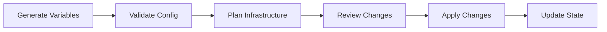

# Infrastructure Standards

> **Canonical reference:** [Infrastructure Standards (full)](https://azurelocal.cloud/standards/infrastructure/)  
> **Applies to:** All AzureLocal repositories  
> **Last Updated:** 2026-04-02

---

## Overview

Standards for Infrastructure as Code (IaC), Terraform state management, and deployment processes for AzureLocal solutions.

---

## Infrastructure Types

All infrastructure is classified by type. These are the **only** valid infrastructure types, defined in the [master registry](https://github.com/AzureLocal/azurelocal-toolkit/blob/main/config/variables/schema/master-registry.yaml):

| Type | Description | Repository |
|------|-------------|------------|
| `azure_local` | Azure Local hyper-converged clusters | `azurelocal-toolkit` |
| `avd_azure` | Azure Virtual Desktop in Azure cloud | `azurelocal-avd` |
| `avd_azure_local` | Azure Virtual Desktop on Azure Local | `azurelocal-avd` |
| `sofs_azure_local` | Scale-Out File Server on Azure Local | `azurelocal-sofs-fslogix` |
| `aks_azure_local` | Azure Kubernetes Service on Azure Local | `azurelocal-toolkit` |
| `loadtools` | Performance and load testing tools | `azurelocal-loadtools` |
| `vm_conversion` | VM generation conversion toolkit | `azurelocal-vm-conversion-toolkit` |
| `copilot` | AI-assisted operations | `azurelocal-copilot` |

---

## Infrastructure Pipeline



---

## State Management

| Principle | Rule |
|-----------|------|
| Remote state | Store Terraform state in Azure Storage Account |
| State locking | Enable locking during all operations |
| Backup | Regular state file backups before destructive operations |
| Naming | `<solution>-<env>.tfstate` (e.g., `platform-prod.tfstate`) |

---

## IaC Tool Parity

All tools must produce **identical infrastructure** when given the same configuration values:

| Tool | Primary Format | State Management |
|------|---------------|-----------------|
| Terraform | `.tf` / `.tfvars` | Remote state in Azure Storage |
| Bicep | `.bicep` / `.bicepparam` | ARM deployment history |
| ARM | `.json` | ARM deployment history |
| PowerShell | `.ps1` | Config-driven, logged |
| Ansible | `.yml` | Inventory-based |

---

## Deployment Phases

| Phase | Scope | Tools |
|-------|-------|-------|
| Phase 1: Azure Foundation | Resource groups, networking, Key Vault, storage | Terraform, Bicep, ARM |
| Phase 2: Compute & Workload | VMs, clusters, workload deployment | Terraform, PowerShell |
| Phase 3: Configuration | Guest config, monitoring, policies | PowerShell, Ansible |

---

## Toolkit Repository Structure

The `azurelocal-toolkit` repository is the reference implementation. All other repos follow the same top-level layout where applicable.

```
azurelocal-toolkit/
├── config/
│   ├── azure/                    # ARM templates, discovery, iDRAC, service principals, utilities
│   └── variables/                # Variable system (see Variable Standards)
│       ├── variables.example.yml # Template (committed)
│       ├── variables.yml         # Your config (gitignored)
│       ├── reports/              # Generated validation reports
│       ├── schema/               # JSON Schema, master registry, alias/drift policy files
│       └── scripts/              # Validation and generation scripts
├── docs/                         # Repo-local documentation
├── logs/                         # Runtime logs (gitignored)
├── pipelines/                    # CI/CD pipeline definitions
├── repo-management/              # Planning docs, ADRs, decision logs
├── scripts/
│   ├── common/                   # Shared modules: ansible, arm-templates, bicep, terraform
│   ├── deploy/                   # Task scripts — mirrors docs/implementation structure (see below)
│   ├── handover/
│   │   ├── customer-transfer/    # Handover checklists and artifacts
│   │   └── documentation/        # Generated customer-facing docs
│   ├── lifecycle/
│   │   ├── operations/           # Day-2 operational scripts
│   │   └── updates/              # Patch and update automation
│   ├── tools/                    # Contributor tooling (script templates, install helpers)
│   └── validation/               # Health checks and test suites
│       ├── arc-tests/
│       ├── cluster-health/
│       ├── network-tests/
│       ├── storage-tests/
│       └── workload-tests/
├── src/                          # IaC source: ansible, arm-templates, bicep, terraform
├── styles/                       # Shared style/lint config
├── tests/                        # Automated test harness
└── tools/                        # Repo-level tools (Generate-SolutionConfig.ps1, planning/)
```

### `scripts/deploy/` Task Contract

Every task folder under `scripts/deploy/` mirrors the path of its corresponding doc in `docs/implementation/` and contains exactly three subdirectories:

```
scripts/deploy/<part>/<phase>/<task>/
├── azurecli/     # Azure CLI scripts (.ps1 using az commands, or .sh)
├── bash/         # Pure Bash scripts (.sh)
└── powershell/   # PowerShell scripts (.ps1)
```

Top-level parts and their phases:

| Part | Phases |
|------|--------|
| `01-cicd-infra` | `phase-01-cicd-setup` |
| `02-azure-foundation` | `phase-01-landing-zones`, `phase-02-resource-providers`, `phase-03-rbac-permissions`, `phase-04-azure-management-infrastructure`, `phase-05-identity-security` |
| `03-onprem-readiness` | `phase-01-active-directory`, `phase-02-enterprise-readiness`, `phase-03-network-infrastructure` |
| `04-cluster-deployment` | `phase-01-hardware-provisioning`, `phase-02-os-installation`, `phase-03-os-configuration`, `phase-04-arc-registration`, `phase-05-cluster-deployment`, `phase-06-post-deployment` |
| `05-operational-foundations` | `phase-01-sdn-deployment`, `phase-02-monitoring-observability`, `phase-03-backup-dr`, `phase-04-security-governance`, `phase-05-licensing-telemetry` |
| `06-testing-validation` | *(tasks directly under part)* |
| `07-validation-handover` | *(tasks directly under part)* |

---

## Related Standards

- [Infrastructure Generation & Deployment Process](https://azurelocal.cloud/standards/infrastructure/infrastructure-generation-deployment-process)
- [State Management](https://azurelocal.cloud/standards/infrastructure/state-management)
- [Solution Development Standard](solutions)
- [Variable Standards](variables) — includes master registry and infrastructure type definitions
- [Automation Interoperability](automation)